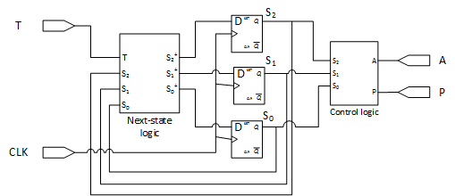

# Combinational Logic Design
## Overview



- In labs 5 and 7, you will design a vending machine controller
- For this lab, you will design the **control logic** which will generate outputs for accepting coins `A` and dispensing products `P`
- As you did in lab 3, start by creating a new project, import the ECE 120 IPs, and create a new block diagram. **Make sure to name the block diagram `vending_machine_control_logic`**
  * It **must** be named this or the testbench/autograder will not recognize it
- If you were working locally previously, starting with this lab, you **must** use `vivado 2023.1`
  * If you were working on EWS, do not worry about this

## Specifications
1. The vending machine will dispense a product when a total of 35 cents has been inserted
2. It may only accept quarters (25 cents) or dimes (10 cents)
3. It will only accept coins that can total to ***exactly*** 35 cents
4. It will also keep track of the history/state following the table below:
  * You will design the history tracking part in lab 7
  * `S2`, `S1`, and `S0` are then the outputs from that part
  * `S2` represents which coin was just inserted, except for states `000` and `100` in which we assume that nothing has been inserted. `S1` and `S0` represent which coin was previously inserted.

| S2 | S1 | S0 | Definition |
|----|----|----|------------|
| 0  | 0  | 0  | No money was previously inserted. No money has just been inserted | 
| 0  | 0  | 1  | A quarter was previously inserted. A quarter has just been inserted | 
| 0  | 1  | 0  | A dime was previously inserted. A quarter has just been inserted | 
| 0  | 1  | 1  | No money was previously inserted. A quarter has just been inserted |
| 1  | 0  | 0  | Unused | 
| 1  | 0  | 1  | A quarter was previously inserted. A dime has just been inserted | 
| 1  | 1  | 0  | A dime was previously inserted. A dime has just been inserted | 
| 1  | 1  | 1  | No money was previously inserted. A dime has just been inserted |

### Ports
| Port Name | Direction |
|-----------|-----------|
| S2        | input     |
| S1        | input     |
| S0        | input     |
| A         | output    |
| P         | output    |

`A` indicates whether the coin that has just been inserted should be accepted.  
`P` indicates whether the product should be dispensed.

### Constraints
While we don't have an area constraint for the simulation, do note that you will need to implement this on a breadboard in the next lab. 
So it is in your best interest to find the minimal area for your implementation.

### Testbench
[top_tb](./tb/top_tb.sv)
You will need to fill in the two lines (`L14` and `L22`) with the expected expression for `A` and `P`

#### How it works
Systemverilog is very similar to C. You should use C bitwise operators to fill in the above lines.  
For example, if your `expected_A` is `NOT(S2) AND S1`, you should write
```
function logic expected_A(logic S2, logic S1, logic S0, logic A, logic P);
    expected_A = ~S2 & S1;
endfunction
```

## Turn-ins (GitHub)
Exported `lab5.tcl`, refer to lab3 if you don't remember how to export. **Remember to verify that you have not created a remote BD by following the steps in the lab3 documentation!**
